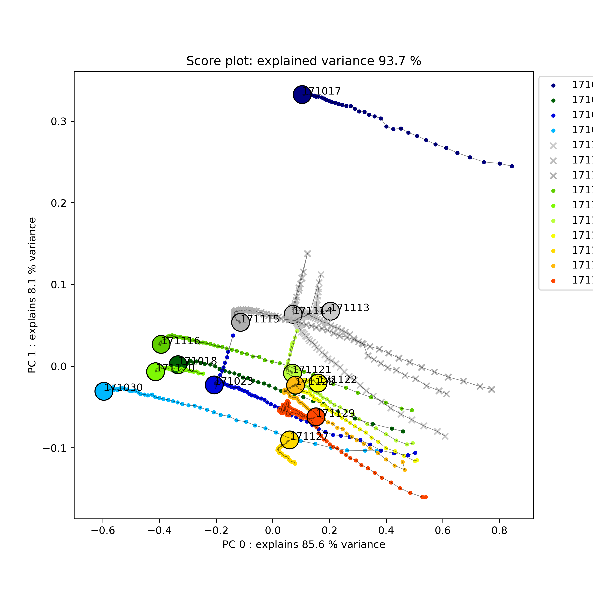

# Background

This (old) repo contains an approach to analyse data from refolding experiments measured via AT-FTIR. The experiments were performed roughly as such:

- Dissolution of inclusion bodies with high urea concentration.
- Continuous dilution of the IB solution into refolding buffer.
- AT-FTIR spectra are measured at discrete timepoints.

The data consist of AT-FTIR spectra taken over time. Due to the high urea background which changes over time, the spectra are not trivial to analyse. Blank correction is applied based on reference spectra.

Due to the lack of proper analysis software like e.g. Simca and the urge to learn more about chemometrics, I implemented some algorithms by hand. The EMSC algorithm is implemented based on the book https://link.springer.com/book/10.1007/978-3-642-17841-2

## Disclaimer
This repo is quite old. The code is not well structured (I had no software development experience at that time) but should work nevertheless.

# Aim

The analysis clusters the experiments based on their processed AT-FTIR spectra over time. The main goal was to find relationships between experiments and gain better insights why some experiments failed.

# Method

The analysis follows more or less following steps:

- Collection of raw data from excel files into [one pickled dataframe](export/one_to_rule_them_all.xlsx) using the file [get_data](scripts/get_data.py)
- Data preprocessing and clustering using the class [AtFtirAnalysis](scripts/include/AtFtirAnalysis.py)
    - preprocessing consists mainly of slicing relevant regions of the wavenumber as well as baseline correction if required
    - classification is performed using PCA as well as via the correlation matrix of each spectra which is converted to an adjacency matrix (described in the notebook [graph_analysis](scripts/graph_analysis.py))
Analysis is performed as outlined in the notebook [data_analysis](scripts/data_analysis.ipynb)

# Results

[Raw Spectra](plots/pca/spectra.png)

[The preprocessed and analyzed Spectra](plots/pca/analyzed_spectra.png)

The following plot shows the evolution of the principal components for each spectra over time. Four clusters can be seen. The blank runs in gray, one outlier representing a failed experiment (171017) and two subclusters for the other runs.

[Cluster Analysis at equilibrium](plots/clustermaps)

PCA of the spectra over time:

